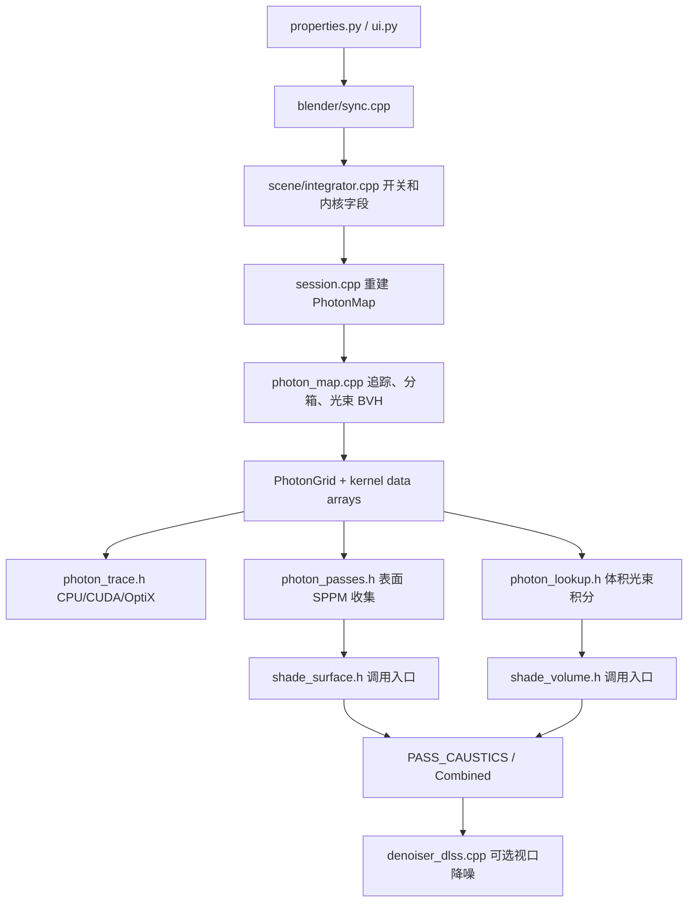

# 个人功能到文件、开关、后端、测试场景映射

> 版本：v2（核对版）
>
> 更新时间：2026-09-10
>
> 适用仓库：`E:\Caustica_Blender_GPL`
>
> 配套规划：[个人下游分支_官方补丁与个人功能隔离同步规划_v2.md](./个人下游分支_官方补丁与个人功能隔离同步规划_v2.md)
>
> 定位：把当前 `main` 里已经存在的个人功能，对应到源码文件、开关、CPU/CUDA/OptiX 路径和固定测试场景。后续拆文件、同步官方、单独回退，都以本表为准。

## 1. 当前仓库状态

```text
工作分支：main
提交：5f0b0b5f293  CyclesPlus: sync selected Blender 5.2.1 fixes
官方基线：Blender 5.2.0 LTS
官方参考标签：upstream-v5.2.0、upstream-v5.2.1
个人标签：v5.2.0-shuimeng-caustics-20260909
远程：https://github.com/geiniyiquan250/Caustica_Blender.git
```

当前本地只有 `main`。规划里的 `feature/*`、`sync/*`、`upstream/*` 分支还没有建立。

当前 `main` 已经同时包含：

- **表面光子焦散（SPPM）** — 个人功能
- **丁达尔体积焦散和有限光束 BVH** — 个人功能
- **玻璃色散（Principled BSDF Transmission Dispersion）** — 个人功能
- CUDA / OptiX 光子内核
- DLSS 视口降噪
- 官方 5.2.0 **不含**上述光子焦散、体积焦散、色散功能
- 选定的官方 5.2.1 Cycles 修复
- 状态栏“Shuimeng个人定制版”标识

这些功能已经能用，但实现仍大量插入官方 Cycles 文件。后续整理目标是：算法进独立文件，官方文件只留调用入口、数据传递和开关。

## 2. 功能总表

> **说明**：标记"个人"的功能在官方 Blender 5.2.0/5.2.1 中不存在，完全由个人实现。

| 功能 | 类型 | 用户开关 | 内部/构建开关 | 独立实现文件 | 主要官方接入点 | 后端 | 固定测试 |
| --- | --- | --- | --- | --- | --- | --- | --- |
| 表面光子焦散 | **个人** | `use_photon_caustics` | `photon_replace_pt`、`photon_partition_pt` | `photon_map.*`、`photon_trace*.h`、`photon_lookup.h`、`photon_passes.h` | `data_template.h`、`shade_surface.h`、`path_trace.cpp`、`session.cpp`、`properties.py` | CPU、CUDA、OptiX | 玻璃板、透镜、猴头、0°/扩散面光 |
| 体积焦散 | **个人** | `use_photon_volume_caustics` | 依赖表面光子开关已开启 | `photon_lookup.h` 光束积分、`photon_map.cpp` 光束 BVH | `shade_volume.h`、`volume.cpp`、`volume_stack.h`、`data_arrays.h` | CPU、CUDA、OptiX | 体积雾、纹理密度、镜头玻璃挡相机、光束开关对照 |
| GPU 光子管线 | **个人** | 无单独 UI | `CYCLESPLUS_PHOTON_GPU_*`、`CYCLESPLUS_PHOTON_OPTIX_*` | `photon_trace.h`、`gpu/kernel.h` 光子内核 | `device/optix/*`、`device/kernel.cpp`、`path_trace_work_gpu.cpp` | CUDA、OptiX；CPU 为回退 | OptiX 加载、CUDA 加载、视口移动、F12 |
| 材质/灯光投射控制 | **个人** | `photon_caustics_casters`、`photon_cast` | `photon_casters_selected`、`photon_shader_caster` | `photon_map.cpp` 材质分类、`photon_trace_types.h` | `shader.cpp`、`light.h`、`blender/shader.cpp`、`ui.py` | 全后端共用 | 全材质 / 仅勾选材质、灯光关闭光子 |
| 玻璃色散 | **个人** | Principled `Transmission Dispersion Scale/Abbe` | `SR_BSDF_HAS_DISPERSION`、`__SPECTRAL__`、`dispersion_inv_abbe` | `photon_trace.h` 波长 IOR、`photon_trace_types.h` | `shader_nodes.cpp`、`features.h`、`path_state.h`、`shade_surface.h`、`bsdf_microfacet.h` | 全后端 | 玻璃本体色散、地面焦散色散、体积光束色散 |
| 性能与剖析 | 无 UI | `CYCLESPLUS_CAUSTICS_PROFILE*`、`CYCLESPLUS_PHOTON_HEURISTICS` | `caustics_profiler.*`、`photon_profile_types.h` | `path_trace.cpp`、`shade_volume.h`、`path_trace_work_gpu.cpp` | 全后端 | 同场景只改一个变量，看体积查询和光子时间 |
| 视口调度 | 无单独开关 | `photon_extra_samples_`、`CYCLESPLUS_PHOTON_VIEWPORT_SAFE` | `photon_map.cpp` 异步批次 | `session.cpp`、`path_trace.cpp`、`render_scheduler.cpp` | 全后端 | 视口导航、F12 并行、场景改动物体后缓存失效 |
| DLSS 视口降噪 | `preview_denoiser=DLSS`、`preview_denoising_upscale_quality` | `WITH_DLSS`、`DENOISER_DLSS` | `denoiser_dlss.cpp/.h`、`FindDLSS.cmake` | `denoiser.cpp`、`device/cuda/device.cpp`、`properties.py`、`ui.py` | CUDA GPU | DLSS 开/关/档位、NGX 日志、控制台不刷屏 |
| UI 与通道 | 焦散面板、Caustics Pass | `_cycles.photon_material_report()` | 无独立 UI 文件 | `properties.py`、`ui.py`、`engine.py`、`python.cpp` | 与渲染无关 | 面板显示、材质警告、通道导出 |
| 构建与发布 | CMake `WITH_DLSS`、CUDA、OptiX | 编译期 | `FindDLSS.cmake` | 根 `CMakeLists.txt`、`intern/cycles/CMakeLists.txt` | Windows Clang Release | 内核文件存在、干净安装包 |
| 品牌 | 无开关 | 无 | 无 | `source/blender/editors/space_info/info_stats.cc` | 与渲染无关 | 状态栏版本字符串 |

## 3. 数据流



官方文件只应继续承担 Sync、Integrator、Session、Shade 这些入口。追踪、分箱、收集、光束查询应继续留在独立文件，并逐步把现在还写在官方文件里的大段逻辑搬回去。

## 4. 逐功能映射

### 4.1 表面光子焦散

**个人功能**。用途：渲染开始后追踪光子，用 SPPM 在接收面上收集焦散。默认叠加到路径追踪，不替换整套 Cycles 焦散。

用户开关：

| 属性 | 位置 | 默认 | 作用 |
| --- | --- | --- | --- |
| `use_photon_caustics` | 渲染属性 > 光程 > 焦散 | 关 | 总开关 |
| `photon_caustics_count` | 同上 | 100 | 每批次百万光子数 |
| `photon_caustics_detail` | 同上 | 10 | 收集半径/锐度 |
| `photon_caustics_intensity` | 同上 | 1.0 | 只乘焦散亮度 |
| `photon_caustics_casters` | 同上 | ALL | 全材质或仅勾选材质投射 |
| `use_pass_caustics` | 视图层通道 | 关 | 单独输出焦散通道 |

内部字段：

> **注意**：默认启发式掩码为 `0x1F`，非 `0x3F`。

```text
integrator.use_photon_caustics
integrator.photon_num
integrator.photon_radius
integrator.photon_inv_cell
integrator.photon_table_size
integrator.photon_batch_weight
integrator.photon_batch_steady
integrator.photon_heuristic_mask
integrator.photon_intensity
integrator.photon_replace_pt          # CYCLESPLUS_PHOTON_REPLACE_PT
integrator.photon_partition_pt        # CYCLESPLUS_PHOTON_PARTITION，默认开
integrator.photon_writer_sample
film.pass_caustics
film.pass_photon_hitpoint / weight / tau / state
film.pass_caustics_lightgroup
```

独立实现：

```text
intern/cycles/integrator/photon_map.cpp
intern/cycles/integrator/photon_map.h
intern/cycles/kernel/integrator/photon_grid.h
intern/cycles/kernel/integrator/photon_trace.h
intern/cycles/kernel/integrator/photon_trace_types.h
intern/cycles/kernel/integrator/photon_lookup.h
intern/cycles/kernel/film/photon_passes.h
intern/cycles/kernel/svm/photon_caustics.h
```

官方接入点：

```text
intern/cycles/kernel/data_template.h
intern/cycles/kernel/data_arrays.h
intern/cycles/kernel/types.h
intern/cycles/scene/integrator.cpp
intern/cycles/scene/film.cpp
intern/cycles/scene/pass.cpp
intern/cycles/kernel/integrator/shade_surface.h
intern/cycles/kernel/integrator/init_from_camera.h
intern/cycles/kernel/integrator/intersect_closest.h
intern/cycles/kernel/integrator/shade_background.h
intern/cycles/kernel/integrator/shade_light.h
intern/cycles/kernel/integrator/shade_dedicated_light.h
intern/cycles/integrator/path_trace.cpp
intern/cycles/session/session.cpp
intern/cycles/blender/sync.cpp
intern/cycles/blender/addon/properties.py
intern/cycles/blender/addon/ui.py
intern/cycles/blender/addon/engine.py
```

后端路径：

| 后端 | 追踪 | 收集 | 说明 |
| --- | --- | --- | --- |
| CPU | `photon_trace_single()` 在 CPU 内核中执行 | `DEVICE_KERNEL_FILM_PHOTON_GATHER` / `SMOOTH` | 完整回退路径 |
| CUDA | `gpu/kernel.h` 的 `photon_trace`、`photon_bin_*` | 同上 gather/smooth | 设备内分箱，少走 PCIe |
| OptiX | 独立 pipeline `PIP_PHOTON`，raygen `__raygen__kernel_optix_photon_trace` | 同上 | 不和主着色 pipeline 混用同一套 launch params |

内核名：

```text
film_photon_gather
film_photon_smooth
photon_trace
photon_bin_count
photon_bin_cursor_init
photon_bin_scatter
```

和官方 MNEE 阴影焦散的边界：

```text
官方：caustics_reflective / caustics_refractive
官方：对象 is_caustics_caster / is_caustics_receiver
官方：灯 is_caustics_light
个人：use_photon_caustics 及 photon_* 全部字段
```

这两套可以同时存在。整理时不要把官方阴影焦散改成光子逻辑。

### 4.2 体积焦散 / 丁达尔光束

**个人功能**。用途：光子在体积里留下有限长光束，相机射线用光束 BVH 做单次散射积分。

用户开关：

| 属性 | 默认 | 作用 |
| --- | --- | --- |
| `use_photon_volume_caustics` | 关 | 体积焦散。界面上从属于 `use_photon_caustics` |

内部字段和数组：

```text
integrator.use_photon_volume_caustics
integrator.photon_volume_beam_num
integrator.photon_volume_beam_node_num
photon_volume_beam_start / end / flux
photon_beam_sigma                 # 主机侧字段（DeviceScene），非内核数组
photon_volume_beam_nodes          # KernelPhotonBeamNode
```

独立实现：

```text
intern/cycles/kernel/integrator/photon_lookup.h
    photon_grid_beam_integral()
intern/cycles/integrator/photon_map.cpp
    体积光束记录、有限光束 BVH
intern/cycles/kernel/types.h
    KernelPhotonBeamNode
```

官方接入点：

```text
intern/cycles/kernel/integrator/shade_volume.h
    volume_integrate_photon_beams()
    均匀介质整段积分
    非均匀介质步进积分
intern/cycles/kernel/integrator/volume_stack.h
intern/cycles/scene/volume.cpp
    体积步长/空散射，给光束积分用
intern/cycles/scene/devicescene.cpp
intern/cycles/kernel/data_arrays.h
```

后端：CPU / CUDA / OptiX 共用同一套 `photon_lookup.h`。体积查询走渲染内核，不走独立 OptiX pipeline。

关键约束：体积焦散不能单独开启。`sync.cpp` 里只有表面光子开启时才会把体积开关写进 integrator。

### 4.3 GPU 光子管线

**个人功能**。用途：光子追踪和分箱尽量留在 GPU，OptiX 使用单独 pipeline，避免和主路径抢 launch params。

独立实现：

```text
intern/cycles/kernel/integrator/photon_trace.h
intern/cycles/kernel/device/gpu/kernel.h      # CUDA 光子内核签名
intern/cycles/kernel/device/optix/kernel.cu   # OptiX raygen
```

官方接入点：

```text
intern/cycles/device/optix/device_impl.h/.cpp
intern/cycles/device/optix/queue.cpp
intern/cycles/kernel/device/optix/globals.h
intern/cycles/device/kernel.cpp
intern/cycles/device/cpu/kernel.cpp
intern/cycles/kernel/device/cpu/kernel_arch.h
intern/cycles/kernel/device/cpu/kernel_arch_impl.h
intern/cycles/integrator/path_trace_work_gpu.cpp
intern/cycles/integrator/path_trace_work.h
```

调试舱口：

```text
CYCLESPLUS_PHOTON_GPU_DISABLE
CYCLESPLUS_PHOTON_GPU_BIN_DISABLE
CYCLESPLUS_PHOTON_GPU_MAXN
CYCLESPLUS_PHOTON_GPU_DEBUG
CYCLESPLUS_PHOTON_OPTIX_HOST
CYCLESPLUS_PHOTON_OPTIX_SYNC
CYCLESPLUS_PHOTON_OPTIX_THROTTLE
CYCLESPLUS_PHOTON_SINGLE_GPU
```

这些舱口不要做成正式 UI。它们只用于同步官方或排查驱动问题时的临时隔离。

### 4.4 材质、灯光、世界投射

**个人功能**。用途：决定谁发射光子、谁接收、谁继续走官方路径追踪焦散。

用户开关：

| 属性 | 对象 | 默认 | 作用 |
| --- | --- | --- | --- |
| `photon_caustics_casters` | 场景 | ALL | ALL=所有会焦散的材质都投射；SELECTED=只投射勾选材质 |
| `photon_cast` | 材质 | 关 | 仅 SELECTED 模式有效 |
| `photon_cast` | 灯 | 开 | 关闭后该灯不占光子预算 |
| `photon_cast` | 世界 | 开 | 关闭后 HDRI/太阳盘不发射光子 |

材质分类结果：

```text
PHOTON_MAT_RECEIVER
PHOTON_MAT_GLASS
PHOTON_MAT_METAL
PHOTON_MAT_SKIP
PHOTON_MAT_VOLUME
```

分类和警告：

```text
intern/cycles/integrator/photon_map.cpp     提取 shader graph
intern/cycles/blender/shader.cpp            图像纹理均值，给快速光子轮廓用
intern/cycles/blender/python.cpp            photon_material_report()
intern/cycles/blender/addon/ui.py           焦散面板显示近似/失效材质
```

官方接入点：

```text
intern/cycles/scene/shader.cpp/.h           shader.photon_cast
intern/cycles/scene/light.h                 light.photon_cast
intern/cycles/kernel/types.h                KernelShader.photon_cast
intern/cycles/kernel/svm/photon_caustics.h  路径追踪是否让出焦散贡献
```

### 4.5 玻璃色散（Principled BSDF Transmission Dispersion）

**个人功能**。官方 Blender 5.2.0/5.2.1 **不含**此功能。

个人实现的 Principled BSDF 色散插槽和内核支持：

```text
Transmission Dispersion Scale
Transmission Dispersion Abbe Number
SR_BSDF_HAS_DISPERSION
__SPECTRAL__                      # 内核宏
path_state.h  dispersion_throughput_weight()
```

核心实现文件：

```text
intern/cycles/scene/shader_nodes.cpp           Principled BSDF 色散插槽
intern/cycles/kernel/features.h                __SPECTRAL__ 宏定义
intern/cycles/kernel/integrator/photon_trace_types.h  PhotonTraceMaterial.dispersion_inv_abbe
intern/cycles/kernel/integrator/photon_trace.h        photon_glass_ior() 波长 IOR

intern/cycles/integrator/photon_map.cpp
    从 Principled 节点提取 scale / Abbe
intern/cycles/kernel/integrator/photon_trace.h
    photon_glass_ior()
    波长加权通量
intern/cycles/kernel/integrator/shade_surface.h
    官方相机路径色散入口，保持原样
```

官方接入点：

```text
intern/cycles/kernel/closure/bsdf_microfacet.h  折射 IOR 计算
intern/cycles/kernel/integrator/path_state.h    dispersion_throughput_weight()
```

### 4.6 性能、启发式、剖析

独立实现：

```text
intern/cycles/util/caustics_profiler.cpp
intern/cycles/util/caustics_profiler.h
intern/cycles/kernel/integrator/photon_profile_types.h
```

接入点：

```text
intern/cycles/integrator/path_trace.cpp
intern/cycles/integrator/path_trace_work_gpu.cpp
intern/cycles/kernel/integrator/shade_volume.h
intern/cycles/session/session.cpp
```

环境变量：

```text
CYCLESPLUS_CAUSTICS_PROFILE=1
CYCLESPLUS_CAUSTICS_PROFILE_DETAIL=1
CYCLESPLUS_CAUSTICS_PROFILE_DIR=<目录>
CYCLESPLUS_PHOTON_HEURISTICS=<掩码>   # 默认 0x1F（全部启用），0=教科书 SPPM
CYCLESPLUS_PHOTON_ACCURATE
CYCLESPLUS_PHOTON_GUIDE_DISABLE
CYCLESPLUS_PHOTON_WORK_CAP
CYCLESPLUS_PHOTON_TIMED_BATCHES
CYCLESPLUS_PHOTON_F12_BREATHER
CYCLESPLUS_PHOTON_F12_NO_BREATHER
CYCLESPLUS_PHOTON_BIN_VERIFY
```

日志和图片只放 `build_test_output/` 或外部目录，不进源码提交。

### 4.7 视口与调度

接入点几乎全在官方调度文件里，这是高冲突区：

```text
intern/cycles/session/session.cpp
    PhotonMap 生命周期
    视口额外样本 PHOTON_EXTRA_SAMPLES_SMOOTH=16
    最大额外样本 48
    F12 期间停掉视口光子流
    场景更新前 abort_inflight()
intern/cycles/integrator/path_trace.cpp
    绑定 PhotonGrid
    收集与平滑调度
intern/cycles/integrator/render_scheduler.cpp
    DLSS 时的调度判断
intern/cycles/kernel/film/adaptive_sampling.h
    光子未成熟时不退休像素
```

视口安全舱口：

```text
CYCLESPLUS_PHOTON_VIEWPORT_SAFE=1    视口强制更稳的降噪路径
CYCLESPLUS_PHOTON_OPTIX_THROTTLE=1   OptiX 光子限速
```

### 4.8 DLSS 视口降噪

用户开关：

| 属性 | 默认 | 作用 |
| --- | --- | --- |
| `use_preview_denoising` | 关 | 视口降噪总开关 |
| `preview_denoiser` | AUTO | 可选 DLSS |
| `preview_denoising_upscale_quality` | BALANCED | DLSS 质量/放大档 |

构建开关：

```text
CMakeLists.txt                 option(WITH_DLSS OFF)
intern/cycles/CMakeLists.txt   find_package(DLSS) -> -DWITH_DLSS
intern/cycles/blender/python.cpp   _cycles.with_dlss
```

独立实现：

```text
intern/cycles/integrator/denoiser_dlss.cpp
intern/cycles/integrator/denoiser_dlss.h
build_files/cmake/Modules/FindDLSS.cmake
```

官方接入点：

```text
intern/cycles/device/denoise.h          DENOISER_DLSS = 8
intern/cycles/device/denoise.cpp
intern/cycles/device/cuda/device.cpp    设备能力标记
intern/cycles/integrator/denoiser.cpp
intern/cycles/scene/integrator.cpp      denoiser_type / upscale_factor
intern/cycles/blender/sync.cpp          视口 DLSS 参数
intern/cycles/blender/addon/properties.py
intern/cycles/blender/addon/ui.py
```

DLSS 只走 NVIDIA CUDA 设备。焦散通道在 OIDN/GPU denoiser 里有单独处理，避免把光子结果当普通噪声清掉：

```text
intern/cycles/integrator/denoiser_gpu.cpp
intern/cycles/integrator/denoiser_oidn.cpp
```

### 4.9 UI、通道、中文面板

```text
intern/cycles/blender/addon/ui.py
    CYCLES_RENDER_PT_light_paths_caustics   标签“焦散”
    光子焦散求解器 / 体积焦散 / 光子数量 / 细节 / 强度 / 投射材质
intern/cycles/blender/addon/engine.py
    Combined 旁的 Caustics 通道
    灯光组 Caustics_<group>
intern/cycles/blender/python.cpp
    photon_material_report
    设备 tuple 第 10 项：是否支持 DLSS
```

官方英文阴影焦散面板仍在：

```text
CYCLES_OBJECT_PT_shading_caustics
灯/世界 Shadow Caustics
```

整理 UI 时，个人中文光子面板和官方阴影焦散面板分开保留。

### 4.10 构建、内核、品牌

```text
CMake：WITH_CUDA、WITH_OPTIX、WITH_DLSS
品牌：source/blender/editors/space_info/info_stats.cc
      "%s Shuimeng个人定制版"
```

品牌只有一行，冲突低，但官方改状态栏格式时仍要手动合并。

## 5. 文件隔离分类

### 5.1 已经独立、优先保护的个人文件

这些文件以整文件为单位属于个人功能。官方同步时默认保留，不拿官方同名文件覆盖。

```text
intern/cycles/integrator/photon_map.cpp
intern/cycles/integrator/photon_map.h
intern/cycles/kernel/integrator/photon_grid.h
intern/cycles/kernel/integrator/photon_lookup.h
intern/cycles/kernel/integrator/photon_trace.h
intern/cycles/kernel/integrator/photon_trace_types.h
intern/cycles/kernel/integrator/photon_profile_types.h
intern/cycles/kernel/film/photon_passes.h
intern/cycles/kernel/svm/photon_caustics.h
intern/cycles/util/caustics_profiler.cpp
intern/cycles/util/caustics_profiler.h
intern/cycles/integrator/denoiser_dlss.cpp
intern/cycles/integrator/denoiser_dlss.h
build_files/cmake/Modules/FindDLSS.cmake
```

### 5.2 高冲突官方文件

这些文件官方常改，个人也改。合并时按函数/字段逐段处理，不整文件覆盖。

| 文件 | 个人插入内容 | 建议整理方向 |
| --- | --- | --- |
| `intern/cycles/kernel/data_template.h` | 光子/体积/启发式字段、焦散通道索引 | 字段集中放到带 CyclesPlus 注释的连续区域，顺序固定 |
| `intern/cycles/kernel/types.h` | 光束 BVH 节点、光子 flag、PASS_PHOTON_*、设备内核枚举 | 新增类型尽量挪到 `photon_grid.h` / `photon_trace_types.h` |
| `intern/cycles/kernel/data_arrays.h` | 光子和光束数组 | 保持追加在个人区域 |
| `intern/cycles/scene/integrator.cpp` | 光子 socket、分区/替换舱口、强度 | 个人 socket 保持一组，不要插到官方 socket 中间 |
| `intern/cycles/kernel/integrator/shade_surface.h` | 光子链、色散调用、收集入口 | 只留调用，算法回 `photon_passes.h` / `photon_caustics.h` |
| `intern/cycles/kernel/integrator/shade_volume.h` | 光束积分、剖面计数 | 大段积分已在 `photon_lookup.h`，这里继续减逻辑 |
| `intern/cycles/integrator/path_trace.cpp` | 绑定光子网格、收集调度、启发式 | 调度入口留下，细节回 `photon_map.cpp` |
| `intern/cycles/session/session.cpp` | PhotonMap 生命周期、额外样本、F12 避让 | 生命周期可考虑薄封装，但现在先标区 |
| `intern/cycles/blender/sync.cpp` | 光子开关同步、灯光组焦散通道、DLSS 档位 | 个人同步放在明确注释块 |
| `intern/cycles/blender/addon/properties.py` | 光子属性和 DLSS 枚举 | 属性名保持稳定，不改默认值语义 |
| `intern/cycles/blender/addon/ui.py` | 中文焦散面板、DLSS 设备检查 | 个人面板独立 class，已基本做到 |

### 5.3 中冲突官方文件

官方更新时通常只需核对调用点：

```text
intern/cycles/blender/python.cpp
intern/cycles/blender/shader.cpp
intern/cycles/blender/addon/engine.py
intern/cycles/scene/devicescene.cpp/.h
intern/cycles/scene/film.cpp
intern/cycles/scene/pass.cpp
intern/cycles/scene/shader.cpp/.h
intern/cycles/scene/shader_nodes.cpp/.h
intern/cycles/scene/light.h
intern/cycles/scene/volume.cpp
intern/cycles/scene/scene.cpp
intern/cycles/kernel/integrator/init_from_camera.h
intern/cycles/kernel/integrator/intersect_closest.h
intern/cycles/kernel/integrator/volume_stack.h
intern/cycles/kernel/integrator/path_state.h
intern/cycles/kernel/integrator/state.h
intern/cycles/kernel/film/adaptive_sampling.h
intern/cycles/kernel/svm/closure.h
intern/cycles/kernel/device/cpu/*
intern/cycles/kernel/device/gpu/kernel.h
intern/cycles/kernel/device/optix/*
intern/cycles/device/optix/*
intern/cycles/device/cuda/device.cpp
intern/cycles/device/kernel.cpp
intern/cycles/device/denoise.cpp/.h
intern/cycles/integrator/denoiser.cpp
intern/cycles/integrator/denoiser_gpu.cpp
intern/cycles/integrator/denoiser_oidn.cpp
intern/cycles/integrator/path_trace_work*.cpp/.h
intern/cycles/integrator/CMakeLists.txt
intern/cycles/CMakeLists.txt
CMakeLists.txt
source/blender/editors/space_info/info_stats.cc
```

## 6. 内核数据数组

个人数组在 `intern/cycles/kernel/data_arrays.h` 的 CyclesPlus photon caustics 区域：

**内核全局数组（GPU 常驻）**：

```text
photon_pos
photon_flux
photon_cell_start
photon_shader_caster
photon_beam_start                 # 光子光束起点
photon_volume_beam_start
photon_volume_beam_end
photon_volume_beam_flux
photon_volume_beam_nodes
```

**主机侧字段（非内核数组）**：

```text
DeviceScene::photon_beam_sigma    # 仅在 devicescene.h/cpp 和 path_trace.cpp 中使用
```

对应 host 结构是 `PhotonGrid`。GPU 常驻批次时，只有 `cell_start` 前缀表走主机，其余沉积数据留在显存。

## 7. 测试场景映射

测试工程和截图不进源码仓库。现有对照结果在 `build_test_output/`，备份在 `backup/`。

| 场景 | 验证功能 | 现有痕迹 |
| --- | --- | --- |
| 平直均匀玻璃板 | 表面焦散形状、能量、半径保护 | `iso_plate.png`、`backup/flat_plate_target_*` |
| 带倒角玻璃板 | 边缘焦散是否断裂 | 规划回归项 |
| 透镜 | 聚焦光斑、和原生路径对照 | `iso_lens.png`、`lens_native.png`、`lens_photon.png` |
| 玻璃板+透镜重叠 | 多层投射 | `iso_both.png`、`overlap_*.exr` |
| 猴头平滑着色 | 曲面收集、法线包装 | 规划回归项 |
| 0° 面光 / 非零扩散面光 | 面光 spread 规格化 | 规划回归项 |
| 单独体积 | 体积焦散开关对照 | `beam_integral_on/off.png`、`beam_final_on/off.png` |
| 纹理控制密度体积 | 非均匀步进光束 | `backup/mixed_volume_fix_*` |
| 玻璃进入体积雾 | 丁达尔光束 | `p2_cylinder_on/off.png` |
| 镜头玻璃挡在相机前 | 相机路径体积标记 | `camera_glass_volume_fix.png`、`camera_glass_profile.png` |
| 色散+焦散 | 光子 IOR 随波长变化 | `backup/dispersion_merge_*` |
| DLSS 开/关/档位 | 视口降噪、放大 | `build_test_output/dlss_sdk_probe`、`dlss_target_diff.txt` |
| CUDA 内核加载 | `photon_trace` 等内核存在 | 安装目录内核文件、启动日志 |
| OptiX 内核加载 | 独立光子 pipeline | 同上 |
| 视口移动 | 异步批次、额外样本、缓存失效 | session 剖析日志 |
| F12 固定分辨率 | 视口光子流停掉、最终渲染稳定 | `CYCLESPLUS_PHOTON_F12_*` 对照 |

每次只改一个变量。视口结果和 F12 结果分开记。

## 8. 后续整理顺序

本映射只梳理，不改源码。真正拆文件时按这个顺序，避免一次动太多高冲突文件：

1. 在高冲突文件里给现有个人代码补齐 `CyclesPlus` 区域标记，先不搬家。
2. 把 `types.h` 里还能搬走的光子 POD 继续收到 `photon_grid.h` / `photon_trace_types.h`。
3. 把 `shade_volume.h` 里剩余光束逻辑继续收到 `photon_lookup.h`。
4. 把 `path_trace.cpp` / `session.cpp` 里能抽出的光子调度收到 `photon_map.cpp`。
5. DLSS 保持现有独立文件，只收紧 `denoiser.cpp` 和 `sync.cpp` 的入口。
6. 每个功能开始用单独提交；官方同步继续用独立 sync 提交。
7. 映射稳定、高冲突文件减薄之后，再建立 `feature/caustics-surface` 等分支，并继续官方版本同步。

## 9. 使用规则

```text
改某个个人功能时，先查本表的独立文件，再查对应官方接入点。
同步官方时，先保护 5.1 的独立文件，再逐段处理 5.2。
回退某个功能时，以该功能的独立文件和接入点清单为准，不整库回退。
新增字段时，先写进本表，再改 data_template.h。
新增开关时，同时补：默认值、UI 或舱口说明、CPU/CUDA/OptiX 安全路径、缓存失效。
```